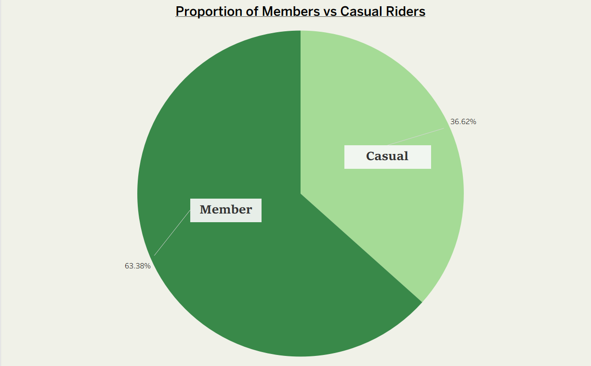
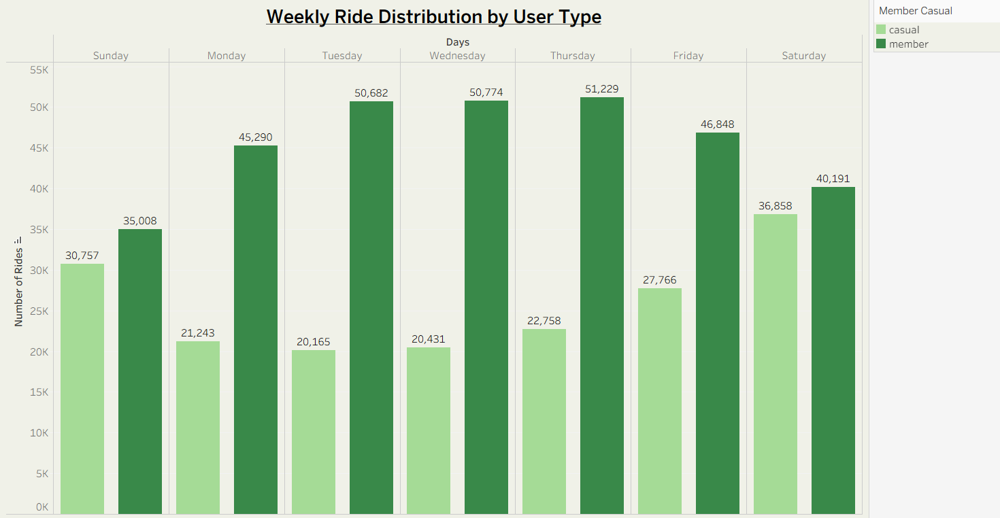
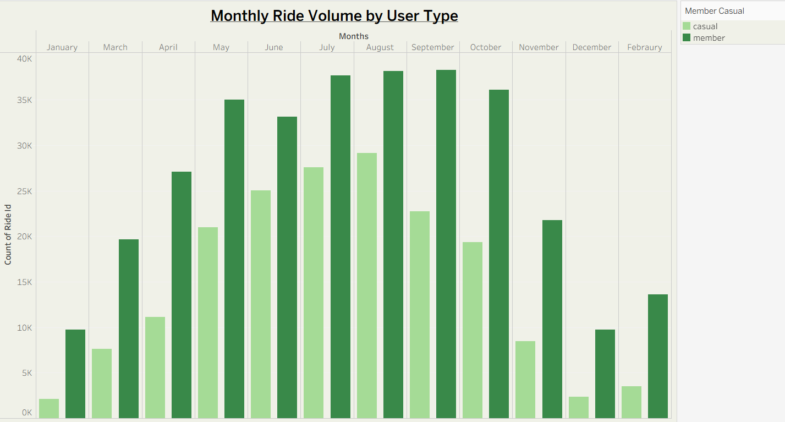
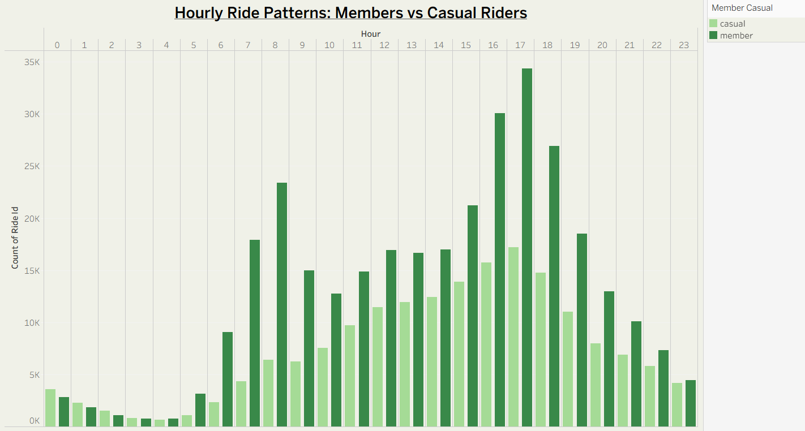
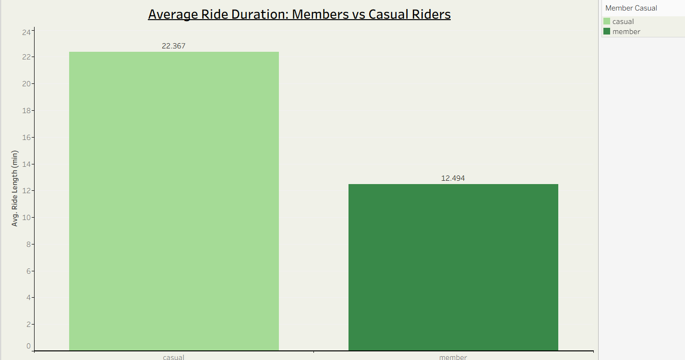
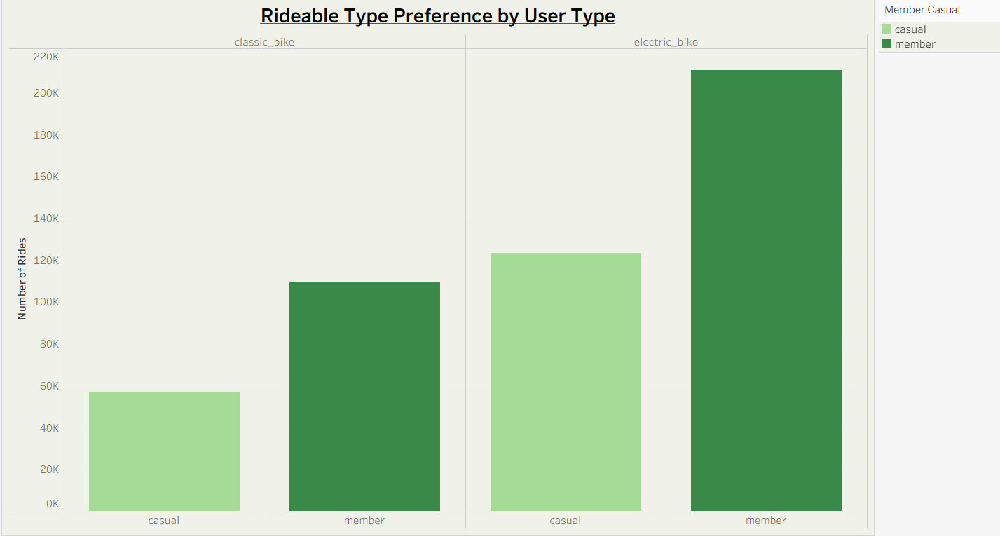

# Cyclistic Bike-Share Data Analysis

**Google Data Analytics Professional Certificate Capstone Project**

**Author: Zaina Khanum**

## Overview
Data analysis of Cyclistic (Divvy) bike-share trip data to understand how annual members and casual riders use the bikes differently. The goal is to provide actionable insights to help convert casual riders into annual members and increase long-term profitability.

## Business Task
The objective of this analysis is to identify behavioral differences between casual riders and annual members. These insights will support the marketing team in developing targeted strategies to convert casual riders into loyal members.

## Tools Used
- **Python**: pandas, numpy (data cleaning, processing, and analysis)
- **Tableau**: Data visualization and dashboard creation
- **Jupyter Notebook**: Reproducible workflow

## Dataset
This analysis uses 12 months of Cyclistic bike-share trip data (June 2025 – May 2026). The dataset consists of monthly CSV files containing trip-level details - ride_id, rideable_type, started_at / ended_at, member_casual, start_station / end_station.

(Due to GitHub file size limits, the sample dataset (50,000 records) is not included in this repository. The cleaned sample data is available upon request.)

## Project Steps
- Downloaded and extracted 12 months of raw CSV files.
- Concatenated all files into a single dataframe.
- Performed comprehensive data cleaning and preprocessing (handled missing values, removed duplicates, validated ride durations, created calculated fields).
- Created a representative sample of **50,000 records** for efficient analysis.
- Conducted exploratory data analysis and built visualizations in Tableau.

## Key Insights with Visualizations

1) **Member riders dominate usage** (63.38% of total rides) compared to casual riders (36.62%).

2) **Weekly patterns differ clearly**: Members prefer weekdays (peak Tuesday–Thursday), while casual riders favor weekends (especially Saturday).

3) **Strong seasonal trend**: Ride volume peaks in summer months (June–August) and drops in winter.

4) **Hourly patterns** show member rides concentrated during commuting hours, while casual rides are more evenly distributed.

  
5) **Casual riders take significantly longer trips** on average (~23 minutes) than members (~13 minutes), indicating more leisure-oriented usage.

6) **Rideable type preference**: Members heavily prefer electric bikes, while casual riders use both types more evenly.

## Recommendations

To increase annual memberships, Cyclistic should:

1. **Weekend Membership Plan**:
Offer discounted weekend subscription plans targeting casual riders who already use the service heavily on weekends.

2. **Targeted Marketing Campaigns**:
Focus ads near tourist-heavy areas and weekends to convert leisure riders to members.

3. **Commuter Incentives**:
Promote annual membership benefits emphasizing convenience and cost savings for daily commuters.

